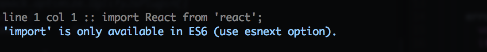
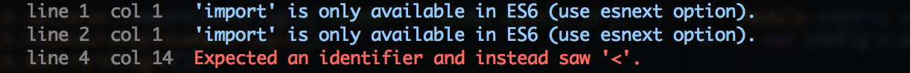

JSHint-Loader Stylish Reporter
==============================

As a big fan of [jshint-stylish](https://github.com/sindresorhus/jshint-stylish), I really wanted to use it with a webpack-based build system. However, [jshint-loader](https://github.com/webpack/jshint-loader) isn't compatible with normal reporters, so instead I forked jshint-stylish to create this! Error reporting resembles that of jshint, with a few slight differences. For example, errors returned from jshint-loader don't include file names, only line numbers, evidence strings, and other miscellaneous data. As a result, the report doesn't include file-specific sections, but is instead a single list of error messages.

## Usage

```js
// webpack.config.js
var stylishReporter = require('jshint-loader-stylish')({
  // options...
});

module.exports = exports = {
  module : {
    preLoaders: [{
      test: /\.js$/,
      exclude: /node_modules/,
      loader: 'jshint'
    }],
  },
  jshint : {
    reporter : stylishReporter
  }
};
```

## Reporter Styles

Since the regular jshint-stylish output doesn't work as well when errors can't be sorted by file, the default output has been adjusted slightly to give you a bit more information:



If you wish to enable the reporter that more closely adheres to vanilla jshint-stylish output, set the `reporter` configuration property to "true-stylish".

```js
require('jshint-loader-stylish')({
  reporter : 'true-stylish'
});
```



## Options

### Reporter (String)

Specify the `reporter` configuration property to the string name of the reporter style you wish to use. These can be found in `jshint-loader-stylish/reporters`.

## TODO
* [ ] Document config options

## Credits

Based on [jshint-stylish](https://github.com/sindresorhus/jshint-stylish) by [sindresorhus](https://github.com/sindresorhus).
